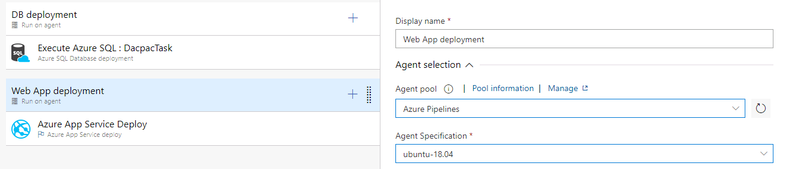

## Exercise 2 Configure an expense category

1. Navigate to **Expense management** and select **Setup**. Select **General** and then select **Expense categories**. 

2. Select **New** to create a new expense category.

3. Select **Representation** in the Category ID field.

4. Select **CreditCard** in the default payment method field which is in the **Expense** fasttab.

5. Enter **601600** in the Main account field. 

6. **Save** the data.

7. **Close** the form. 

 

## Exercise 3 Create an expense report that uses the new expense category

1. Navigate to **Expense management**, select **My expenses**, and then select **Expense reports**.

2. Select **New expense report** to create a new report.

3. Select **Customer** **visit** in the purpose field.

4. Select **Main office** in the location field. 

5. Select **OK.**

6. Enter **2/1/2022** as the transaction date.

7. Select **Representation** in the Expense category.

8. Type **150.00** in the Transaction amount field.

9. **Save** the data.

10. Select **Workflow** in the action pane. You may need to select the ellipsis (...) to see the option.

11. Select **Submit**.

12. Enter **Dinner with a potential customer** in the comment field.

13. **Submit** the expense report.

The approval status of the expense report will change to In review.

